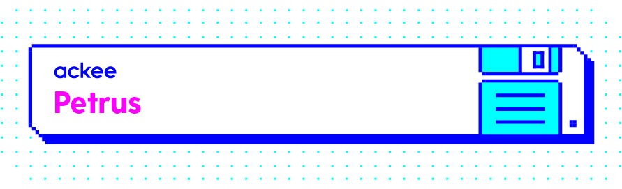

# [](https://github.com/AckeeCZ/petrus/blob/master/LICENSE) [](https://travis-ci.com/AckeeCZ/petrus) [](https://reactjs.org/docs/how-to-contribute.html#your-first-pull-request) [](https://david-dm.org/AckeeCZ/petrus) [](https://bundlephobia.com/result?p=@ackee/petrus) [](https://bundlephobia.com/result?p=@ackee/petrus)

# Petrus

The library handles authentication logic with token based flow.

### Main features

-   **automatically refresh access token** before it expires
-   **persisting tokens state** in local or session storage (optional)
-   automatically **fetching an authorized user** after successful tokens retrieval from a persistent storage
-   simple API for auth state management: [`getAuthStateChannel`](./docs/api.md#get-auth-state-channel), [`withAuthSession`](./docs/api.md#with-auth-session)
-   `authorizable` HOC - render content (a firewall, an authorized content or a loader) based on current auth. state

> ### Requirements
>
> The library relies on `react`, `redux`, `react-redux`, `redux-saga` and `reselect` packages as peer dependencies.

---

## Table of contents

-   [Installing](#installing)
-   [Usage](#usage)
-   [Usage Examples](./docs/usage-examples/index.md)
-   [API Reference](./docs/api.md#api)
    -   [Components](./docs/api.md#components)
    -   [Action creators](./docs/api.md#action-creators)
    -   [Action types](./docs/api.md#action-types)
    -   [Constants](./docs/api.md#constants)
    -   [Selectors](./docs/api.md#selectors)
    -   [Utilities](./docs/api.md#utilities)
    -   [HOC](./docs/api.md#hoc)

---

## <a name="installing"></a>Installing

Using yarn:

```bash
$ yarn add @ackee/petrus
```

Using npm:

```bash
$ npm i -S @ackee/petrus
```

## <a name="usage"></a>Usage

### Minimal required configuration

```js
import { configure } from '@ackee/petrus';

// 1. Provide authenticate, refreshTokens and getAuthUser methods
const { saga, reducer } = configure({
    handlers: {
        authenticate,
        refreshTokens,
        getAuthUser,
    },
});

// 2. Add auth reducer
const rootReducer = combineReducers({
    auth: reducer
});

// 3. And launch the saga
function*() {
    yield all([saga()])
}
```

> To see defaults and available configurations with examples, go [here](./docs/api.md#configure).

### Usage with [`@ackee/antonio`](https://github.com/AckeeCZ/antonio/tree/master/packages/@ackee/antonio-auth#requestauthheaderinterceptorrequest-request-request)

### With OAuth2

`@ackee/petrus` supports following OAuth2 flows:

-   [Implicit grant flow](https://docs.gitlab.com/ee/api/oauth2.html#implicit-grant-flow)
    -   Matches with the default configuration.
    -   `origin` property is required
-   [Web application flow](https://docs.gitlab.com/ee/api/oauth2.html#web-application-flow)
    -   Additionally to the _Implicit grant flow_, you have to provide the `fetchAccessToken` method.

See how to setup `@ackee/petrus` for these flows [here](./docs/oAuth.md).
