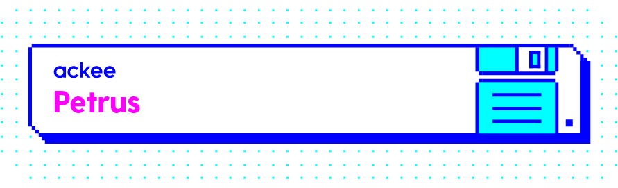

# [](https://github.com/AckeeCZ/petrus/blob/master/LICENSE) [](https://bundlephobia.com/result?p=@ackee/petrus)

# Petrus

A tool for handling token-based authentication in `react`, `redux`, `redux-saga` applications.

It automatically refreshes an access token based on provided expiration timestamp, persists state, so the authentication session can last longer.

---

## Table of contents

-   [Installation](#installation)
-   [Usage Examples](#usage-examples)
-   [API](https://github.com/AckeeCZ/petrus/wiki/Exports)

---

## Installation

```bash
$ yarn add @ackee/petrus
```

### Stack Dependencies

The library required following peer dependencies:

```
 "core-js": "3.x",
 "react": "16.x | 17.x | 18.x",
 "react-redux": "7.x | 8.x",
 "redux": "4.x",
 "redux-saga": "1.x"
```

---

## Usage examples

<!-- These codesandboxes are generated as described here: https://codesandbox.io/docs/importing#using-githubboxcom -->

### Authentication flows

1.  Direct authentication (with password)

    -   [Basic config](https://githubbox.com/AckeeCZ/petrus/tree/master/codesandboxes/basic?file=/src/modules/petrus/index.ts)
        -   Obtaining tokens with `authenticate` method by sending credentials to an endpoint from `loginRequest` Redux action.
        -   Fetching authorized user with `getAuthUser` method.
        -   Automatically refreshing `accessToken` based on provided `expiration` prop.
        -   Tokens and auth. user local persistence in IndexedDB.
        -   Using custom TS types for auth user, tokens, and credentials.

2.  Federated authentication (with a token)

    -   [OAuth 2.0 – Authorization Code Flow](https://githubbox.com/AckeeCZ/petrus/tree/master/codesandboxes/oauth-authorization-code?file=/src/modules/petrus/index.ts)

        > What's an authorization code flow?
        >
        > -   The front channel flow is used by the client application to obtain an authorization code grant.
        > -   The back channel is used by the client application to exchange the authorization code grant for an access token (and optionally a refresh token).
        > -   High security flow.

    -   OAuth 2.0 – Implicit Flow

        > What's an implicit flow?
        >
        > -   An access token is returned directly from the authorization request (front channel only). It typically does not support refresh tokens.
        > -   This flow is also called 2 Legged OAuth.
        > -   Low security by default, make sure to follow at least [these security rules](https://developer.okta.com/blog/2017/06/21/what-the-heck-is-oauth#security-and-the-enterprise).

    Of course, you can choose from any other numerous flows available.<br/>
    Learn more about OAuth flows in ["What the heck is OAuth?"](https://developer.okta.com/blog/2017/06/21/what-the-heck-is-oauth) article.

### Other examples

3.  Usage with [`@ackee/antonio` API client](https://github.com/AckeeCZ/antonio/tree/master/packages/@ackee/antonio-auth#requestauthheaderinterceptorrequest-request-request)
