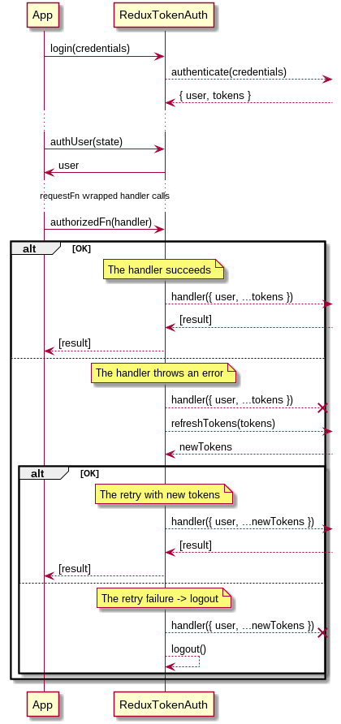

# token-auth

The library tackles a token based communication flow between a redux app and an data resource provider.

## Problem/solution

The problem: Given an token based communication schema, e.g. OAuth2, where valid **access token** is required for each request. Once access token expires, a different endpoint is called with **refresh token** to refresh the token pair. The communication then continues with the access token.

The solution: `requestFn`. A functional wrapper that does the refresh process for you and retries the wrapped function call when it failes due to an expired token.

## API

### Selectors

#### `authUser(state: Object) => user:any`

Gets the user returned from `authenticate` method.

#### `isLoggedIn(state: Object) => bool`

Returns `true` whether user is logged in, `false` otherwise.

#### `isLoggingIn(state: Object) => bool`

Returns `true` whether the login process is taking place, `false` otherwise.

### Initialization

#### `configure(config: Object) => void`

Sets the package configuration with an config object. Following config properties are supported:

- `authenticate: Function`,
- `refreshTokens: Function`,
- `shouldRefresh: Function`.

Any of the functions can also be a saga generator.

##### `authenticate(credentials: any) => {user: any, tokens: any }`

Required. This method is called when a `login(credentials)` action is dispatched. These credentials are passed to `authenticate` method.

The method is exepected to return/or resolve with an Object with props `user, tokens` or throw an error. User and tokens are then stored as is to the redux state for later use.

##### `refreshTokens(tokens: Object) => tokens:Object`

Optional. This method is called when the `requestFn` catches an error and `shouldRefresh` returns true. This triggers the token-refresh process.

Function is expected to return/or resolve with an tokens Object (`{ [tokenName: string]: token }`)

All handlers passed to `requestFn` are now blocked until the refresh process is complete. This is to prevent the refresh process to be started by simultaneous failing tasks. **Default**: no-op.

##### `shouldRefresh(error: Error) => boolean`

Optional. This function is called when the `requestFn` catches an error and should decide, whether to refresh the tokens and retry the action or not. **Default**: `() => true`.

### `saga() => ReduxSaga`

Initializes the saga handlers generator. This should be passed along with your other sagas.

### `reducer: ReduxReducer`

The lib reducer. Needs to be plugged in under the `auth` key. Reducer name is not-yet configurable.

### Utilities

#### `authorizedFn(handler: Function)`

A saga wrapper for the given `handler` Function or a saga generator.

The handler is called with `{ ...tokens, user }` you returned in `configure.authenticate` and `configure.refreshTokens`.

### Action creators

#### `logout() => ReduxAction`

Triggers a user logout. This clears the state of any auth data.

#### `setTokens(tokens: Object) => ReduxAction`

Sets the tokens to the state. In case you want to set them manually.

*This should be used at application startup only. Using this elsewere is considered to be an anti-pattern.*

#### `refreshTokens() => ReduxAction`

Triggers the refresh-tokens process.
